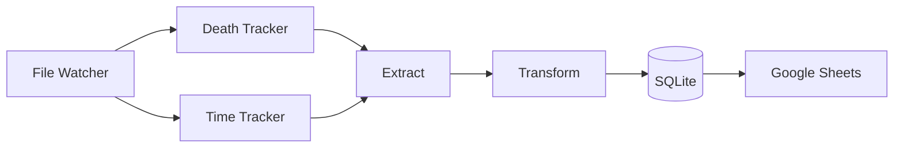
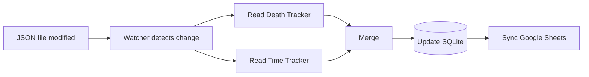

# gd-Pipeline
A Python pipeline that collects data (telemetry) from Geode Mods (Death Tracker and Playtime Tracker), stores it in SQLite database and synchronizes it with Google Sheets.

## About
gd-Pipeline replaces the manual work of sending data for a spreadsheets (especially Google Sheets).
While you play geometry dash, it monitors the local files you have by Death and Playtime Tracker, creating a database (in this case, SQLite) and inserting everytime this files updates.
Creating a Google Sheets to mirror this data, anyone can see your progress in geometry dash in **near real time**!

### Motivation
Famous geometry dash players, like Zeronium, has a spreadsheet of he's progress with Extreme Demons, but everything is totally manual and we only can see new progress if he updates the spreadsheet.
So, I thought that would be very cool if we have a program capable to do this automatically. That's how gd-Pipeline was born.

## Features

- Monitor Death Tracker and Playtime Tracker (the JSON files)
- Merge data from both Mods
- Store the data in a SQLite file
- Synchronize automatically with Google Sheets
- Ignore completed levels after completion
- (For now, you can't customize what you want to store)

## Architecture Overview
### Components

### Flow

### States

- If you want more details, please check **docs/architecture.md**

### Technologies
- Python
- SQLite
- Google Sheets API
