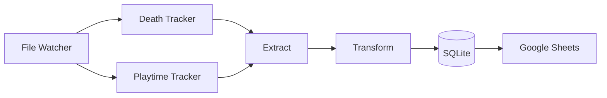
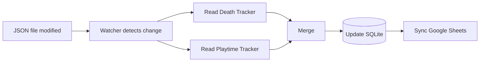

# gd-Pipeline

A Python data pipeline that collects telemetry from Geometry Dash mods (Death Tracker and Playtime Tracker), stores it in a SQLite database, and synchronizes it with Google Sheets.

## About

gd-Pipeline replaces the manual process of updating spreadsheets (especially Google Sheets) with Geometry Dash progress.

While you play Geometry Dash, the application monitors the JSON files generated by Death Tracker and Playtime Tracker. Whenever those files are updated, the pipeline extracts the data, stores it in a SQLite database, and synchronizes it with a Google Sheets.

This allows anyone to follow your Geometry Dash progress in **near real time**.

## Motivation

Many well-known Geometry Dash players, such as Zeronium, maintain public spreadsheets to track their progress on Extreme Demon levels. However, these spreadsheets are updated manually, so viewers only see new progress after the player edits them.

I thought it would be cool to automate this entire process for every level, not just Extreme Demons. That's how **gd-Pipeline** was born.

## Features

- Monitor the JSON files generated by Death Tracker and Playtime Tracker
- Merge data from both mods
- Store the data in a SQLite database
- Synchronize automatically with Google Sheets
- Stop updating a level after it has been completed
- Currently, you can't customize what you want to store (customization is planned for future versions)

## Architecture Overview

### Components

### Flow

For more details, see **documentation/architecture.md**.

## Technologies

- Python
- SQLite
- Google Sheets API
