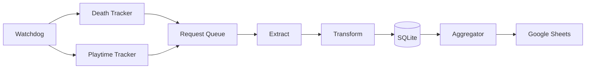
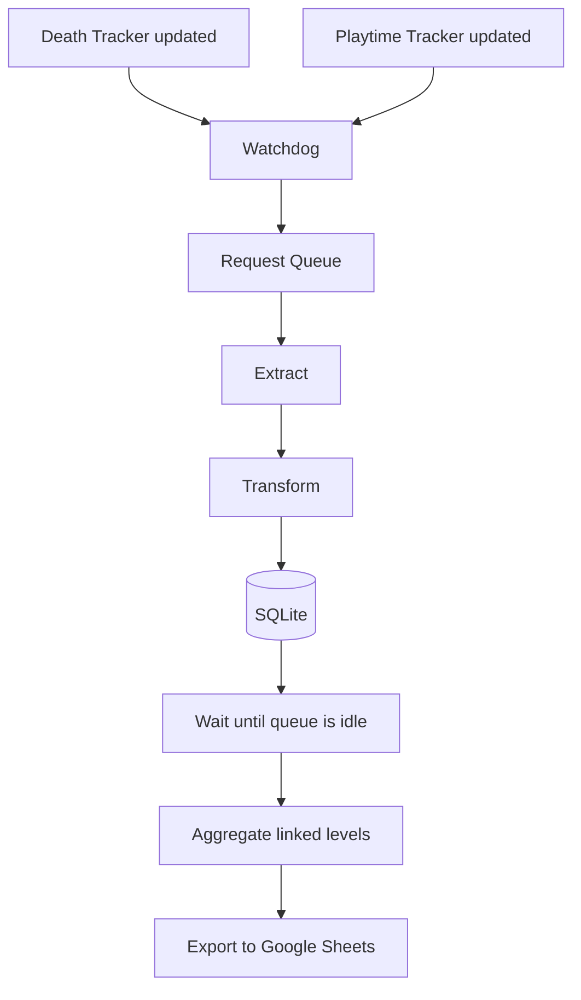

# gd-Pipeline 

Near real-time Geometry Dash data pipeline. 

Automatically extracts gameplay statistics from multiple local trackers, transforms them into a relational model, stores them in SQLite and synchronizes an aggregated datas to Google Sheets. 

--- 

## About 

**gd-Pipeline** is a personal Data Engineering project designed to automate Geometry Dash progression tracking. 

The pipeline continuously monitors the JSON files generated by Geometry Dash tracking mods, extracts gameplay telemetry, merges information coming from game mods, stores everything inside SQLite as the **Source of Truth**, aggregates linked progressions and finally synchronizes the processed data with Google Sheets. 

The result is a live sheets capable of tracking player progression in **near real time** without any manual spreadsheet editing. 

--- 

## Motivation 

Many well-known Geometry Dash players (such as the streamer/youtuber Zeronium) maintain public spreadsheets to track their progress on Extreme Demon levels. However, these spreadsheets are updated manually, so viewers only see new progress after the player edits them. I thought it would be cool to automate this entire process for every level, not just Extreme Demons. That's how **gd-Pipeline** was born. 

--- 

## Features 
- Near real-time synchronization using Watchdog.
- Automatic detection of gameplay events.
- Full database reconstruction through Scanner mode.
- SQLite as the project's **Source of Truth**.
- Automatic aggregation of linked levels.
- Google Sheets synchronization.
---
  
## Architecture Overview 

### Components

```mermaid
flowchart LR

    W[Watchdog]

    DT[Death Tracker]
    PT[Playtime Tracker]

    Q[Request Queue]

    EX[Extract]
    TR[Transform]

    DB[(SQLite)]

    AG[Aggregator]

    GS[Google Sheets]

    W --> DT
    W --> PT

    DT --> Q
    PT --> Q

    Q --> EX
    EX --> TR
    TR --> DB

    DB --> AG
    AG --> GS
```
--- 

### Pipeline Flow

```mermaid
flowchart TD

    A[Death Tracker updated]
    B[Playtime Tracker updated]

    A --> C[Watchdog]
    B --> C

    C --> D[Request Queue]

    D --> E[Extract]

    E --> F[Transform]

    F --> G[(SQLite)]

    G --> H[Wait until queue is idle]

    H --> I[Aggregate linked levels]

    I --> J[Export to Google Sheets]
```

--- 
## Synchronization Strategy 

The file watcher can generate multiple filesystem events for the same gameplay action, instead of processing every event immediately, gd-Pipeline does a Request Queue. 

The queue performs two important tasks: 
- Merge duplicated requests referring to the same level.
- Delay Google Sheets synchronization until the queue remains idle for a short period.

This prevents duplicated processing, reduces unnecessary API calls and guarantees consistent updates while preserving the near real-time synchronization. 

--- 

## Documentation 

Detailed documentation is available inside the docs/ folder. 
- Architecture
- Data Dictionary
- Synchronization (Google Sheets)
- Linked Levels
- Database Schema

--- 

## Technologies 
- Python - SQLite
- Google Sheets API
- Watchdog
- Git
-
--- 

## Live Sheets 

You can see the pipeline in Action! Here is my Google Sheets: 

https://docs.google.com/spreadsheets/d/14xqwLDzUZN8fB-A04njVGGoz8dA_kH39WKy2A9vmkaw/edit?usp=sharing
