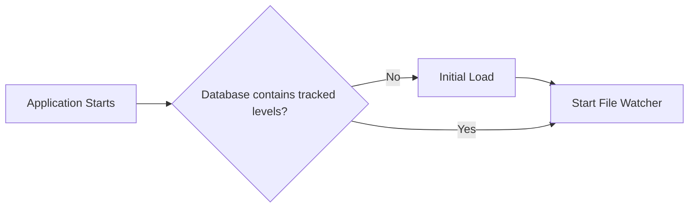
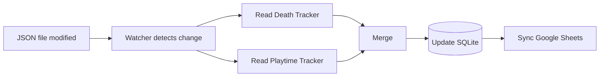
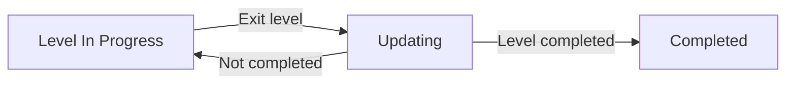

# Architecture

## Overview

gd-Pipeline follows an event-driven ETL architecture.

Whenever a monitored JSON file is modified, the pipeline is executed automatically. The application extracts data from both Geode mods, transforms the information into a unified data model, stores it in SQLite, and synchronizes the latest state with Google Sheets.

SQLite is the source of truth, while Google Sheets acts as a visualization layer.

---

# Pipeline Modes

gd-Pipeline supports two execution modes.

## Initial Load

The Initial Load is executed when the application starts and the database contains no tracked levels.

During this stage, every existing Death and Playtime tracker file is processed to build the initial database state before continuous monitoring begins.

## Incremental Update

After the Initial Load has completed, the application enters continuous monitoring mode.

Whenever the File Watcher detects a modification in a monitored JSON file, only the affected level is processed and synchronized.

---

# Pipeline Execution

During Incremental Update, the pipeline is triggered whenever the File Watcher detects a modification in one of the monitored JSON files.

The execution consists of four stages:

1. Extraction
2. Transformation
3. Persistence
4. Synchronization

---

## State Diagram

While the player has not completed the level, the pipeline keeps updating its statistics every time the player exits the level.

Once the level has been completed, the record becomes immutable and will no longer receive updates.

---

# Components

## File Watcher

Responsible for monitoring the JSON files generated by Geode mods after the Initial Load has completed.

Whenever a modification is detected, the pipeline execution starts.

---

## Death Tracker

Death Tracker provides most of the gameplay statistics.

Responsibilities:

- Canonical level identifier
- Original Geometry Dash level identifier
- Level name
- Attempts
- Current Best
- Worst Fail
- Difficulty
- Linked Levels

---

## Playtime Tracker

Playtime Tracker is responsible only for playtime information.

Responsibilities:

- Session history (in a future version)
- Total playtime

Unlike Death Tracker, Playtime Tracker does not distinguish between Original, Daily, Weekly, Event and Gauntlet levels.

---

## Extract

Reads the JSON files and converts them into Python objects.

No Data Processing is applied during this stage.

---

## Transform

Responsible for combining information from both mods into a single data model.

Data Processing is applied here, such as:

- Merge linked levels
- Calculate total playtime
- Ignore completed levels

---

## SQLite

SQLite stores the latest state of every tracked level.

It is the primary data store.

---

## Google Sheets

Google Sheets mirrors the SQLite database and it is used only for visualization and data sharing.

All updates are synchronized from the SQLite database, but no data is written directly to Google Sheets.

---

# Canonical Identifier

Each level stored by gd-Pipeline contains two identifiers.

| Identifier | Description |
|------------|-------------|
| canonical_id | Unique identifier used internally by gd-Pipeline |
| level_id | Original Geometry Dash level ID |

The canonical identifier is derived from the Death Tracker filename.

Examples:

| Death Tracker filename | canonical_id | level_id |
|-----------------------|--------------|----------|
| 144807542 | 144807542 | 144807542 |
| 144807542-daily | 144807542-daily | 144807542 |

This prevents collisions between Original, Daily, Weekly, Event and Gauntlet variants while preserving the original Geometry Dash id.

---

# Design Decisions

## Event-driven architecture

After the Initial Load has completed, the pipeline only runs when one of the monitored JSON files changes.

This avoids unnecessary processing and keeps resource usage low.

---

## SQLite as the source of truth

SQLite stores the authoritative version of the data.

Google Sheets is synchronized from SQLite and should never be treated as the primary data source.

---

## Completed Levels

A level is continuously updated until it is completed, after that its statistics become immutable.

This prevents historical data from being accidentally overwritten and reflects the project's goal of tracking the completion state of each level.

---

## Data Responsibility

Each mod is responsible for a different set of information.

| Data | Source |
|------|--------|
| Canonical ID | Death Tracker |
| Level ID | Death Tracker |
| Level Name | Death Tracker |
| Difficulty | Death Tracker |
| Attempts | Death Tracker |
| Current Best | Death Tracker |
| Worst Fail | Death Tracker |
| Playtime | Playtime Tracker |
| Completion Status | gd-Pipeline |
| Completion Date | gd-Pipeline |

