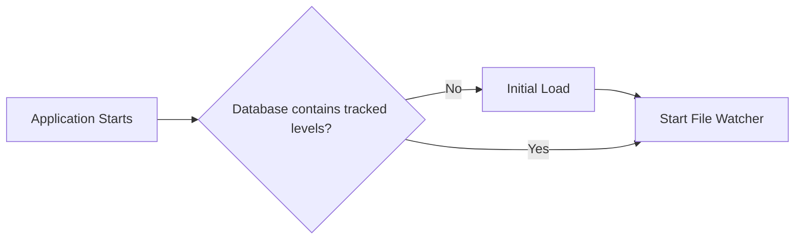
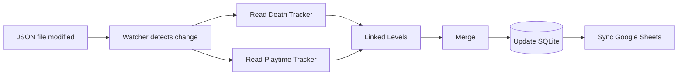
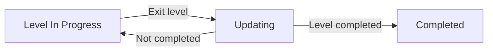

# Architecture

## Overview

gd-Pipeline follows an event-driven ETL architecture.

Whenever a monitored JSON file is modified, the pipeline is executed automatically. The application extracts data from both Geode mods, transforms the information into a unified data model, stores it in SQLite, and synchronizes the latest state with Google Sheets.

SQLite is the source of truth, while Google Sheets acts as a visualization layer.

---

# Pipeline Modes

gd-Pipeline supports two execution modes.

## Initial Load

The Initial Load is executed when the application starts and the database contains no tracked levels.

During this stage, every existing Death and Playtime tracker file is processed to build the initial database state before continuous monitoring begins.

## Incremental Update

After the Initial Load has completed, the application enters continuous monitoring mode.

Whenever the File Watcher detects a modification in a monitored JSON file, only the affected level is processed and synchronized.

---

# Pipeline Execution

During Incremental Update, the pipeline is triggered whenever the File Watcher detects a modification in one of the monitored JSON files.

The execution consists of four stages:

1. Extraction
2. Transformation
3. Persistence
4. Synchronization

---

## State Diagram

While the player has not completed the level, the pipeline keeps updating its statistics every time the player exits the level.

Once the level has been completed, the record becomes immutable and will no longer receive updates.

---

# Components

## File Watcher

Responsible for monitoring the JSON files generated by Geode mods after the Initial Load has completed.

Whenever a modification is detected, the pipeline execution starts.

---

## Death Tracker

Death Tracker provides most of the gameplay statistics.

Responsibilities:

- Canonical level identifier
- Original Geometry Dash level identifier
- Level name
- Tracked attempts
- Current Best
- Worst Fail
- Difficulty
- Linked Levels

---

## Playtime Tracker

Playtime Tracker is responsible only for playtime information.

Responsibilities:

- Session history (in a future version)
- Total playtime

Unlike Death Tracker, Playtime Tracker does not distinguish between Original, Daily, Weekly, Event and Gauntlet levels.

---

## Extract

Reads the JSON files and converts them into Python objects.

No Data Processing is applied during this stage.

---

## Transform

Responsible for combining information from both mods into a single `Level` object. 
During this stage, data from Death Tracker and Playtime Tracker is merged and transformed into the application's internal model.

Data Processing is applied here, such as:

- Resolve linked level groups
- Compute progression statistics
- Calculate total playtime

### Progress Rules
Progression-related fields are computed only from runs beginning at 0%.
Start Position runs are treated as practice runs and therefore never affect:

- current_best
- worst_fail
- completed
- completion_date

However, they still contribute to:

- attempts
- tracked_attempts
- playtime

These rules are evaluated independently for each level before any group synchronization takes place.

---

## Persistence

After transformation, the resulting `Level` is stored in SQLite.

Once the record has been persisted, gd-Pipeline synchronizes the completion state across every level sharing the same `master_level_id`.

Only completion-related fields are synchronized:

- completed
- completion_date

All other fields remain independent and are only aggregated during synchronization with Google Sheets.

---

## SQLite

SQLite stores the latest state of every tracked level.
It is the primary data store.

---

## Google Sheets

Google Sheets mirrors the SQLite database and it is used only for visualization and data sharing.
All updates are synchronized from the SQLite database, but no data is written directly to Google Sheets.

---

# Canonical Identifier

Each level stored by gd-Pipeline contains three identifiers.

| Identifier      | Description |
| --------------- | ------------|
| canonical_id    | Unique identifier of a tracked JSON file|
| level_id        | Original Geometry Dash level ID|
| master_level_id | Representative Geometry Dash level identifier for a linked-level group |

The canonical identifier is derived from the Death Tracker filename.
Every linked level in the same group shares the same ``master_level_id``.

Examples:

| Death Tracker filename | canonical_id | level_id | master_level_id |
|-----------------------|--------------|----------|------------------|
| 144807542 | 144807542 | 144807542 | 144807542 |
| 144807542-daily | 144807542-daily | 144807542 | 144807542 |

This prevents collisions between Original, Daily, Weekly, Event and Gauntlet variants while preserving the original Geometry Dash id.

---
## Linked Levels

Death Tracker stores linked levels as a list inside the metadata JSON of each level. If the user does not link any level, the list remains empty.

gd-Pipeline assigns the same `master_level_id` to every linked level, allowing the application to identify levels that belong to the same logical progression while preserving each original record, then the representative level is selected as the linked online or local level with the smallest Geometry Dash `level_id`.

Therefore, the `master_level_id` is always equal to the smallest `level_id` within the linked-level group. This strategy provides a deterministic identifier for linked-level groups without requiring additional metadata beyond what Death Tracker already provides.

### Completion Synchronization

Each linked level is stored independently inside SQLite. After a level is persisted, gd-Pipeline synchronizes the completion state across **every record** sharing the same `master_level_id`.

Fields that are synchronized:

- completed
- completion_date

This guarantees that completing any linked level marks the entire logical progression as completed, while preserving the individual statistics of each record.

## Statistics Aggregation

Statistics are never merged inside SQLite.

Instead, every linked level preserves its own history, including:

- attempts
- tracked_attempts
- playtime
- current_best
- worst_fail

Aggregation is performed only during synchronization with Google Sheets.

### Example

| level_id | master_level_id | level_name |
|----------|-----------------|------------|
| 2241592 | 2241592 | Necropolis |
| 91735946 | 2241592 | Necropolis StartPos |
| 6839035 | 2241592 | Necropolis Copyable |

### Notes
At that stage, every record sharing the same `master_level_id` is treated as a single logical progression.

# Design Decisions

## Event-driven architecture

After the Initial Load has completed, the pipeline only runs when one of the monitored JSON files changes.

This avoids unnecessary processing and keeps resource usage low.

---

## SQLite as the source of truth

SQLite stores the authoritative version of the data.

Google Sheets is synchronized from SQLite and should never be treated as the primary data source.

---

## Completed Levels

A linked-level group is considered completed as soon as any level in the group reaches 100%. After that, the aggregated record becomes immutable and will no longer receive updates.
This prevents historical data from being accidentally overwritten and reflects the project's goal of tracking the completion state of each level.

---

## Data Responsibility

Each mod is responsible for a different set of information.

| Data | Source |
|------|--------|
| Canonical ID | Death Tracker |
| Level ID | Death Tracker |
| Master Level ID | Death Tracker + gd-Pipeline |
| Level Name | Death Tracker |
| Difficulty | Death Tracker |
| Attempts | Geometry Dash Metadata |
| Tracked Attempts | Death Tracker |
| Current Best | Death Tracker + gd-Pipeline |
| Worst Fail | Death Tracker + gd-Pipeline |
| Playtime | Playtime Tracker |
| Completion Status | gd-Pipeline |
| Completion Date | gd-Pipeline |

