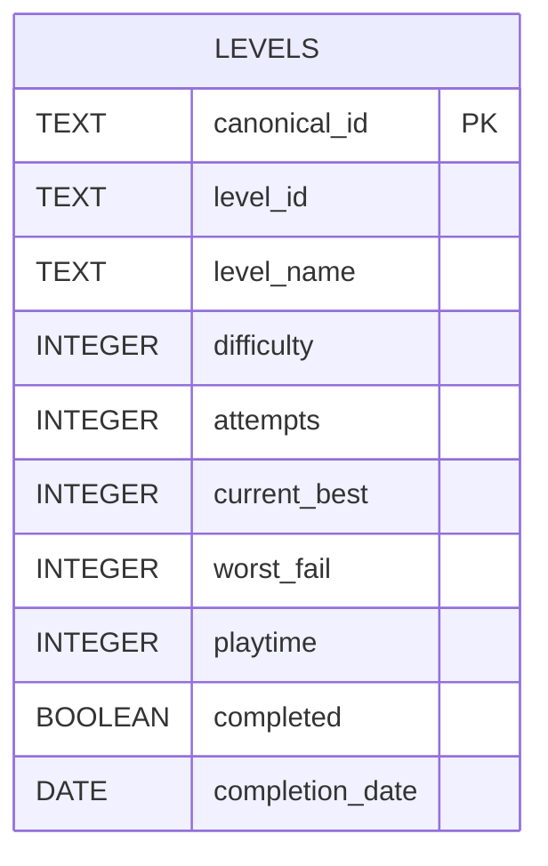

# Database

## Overview

The SQLite database stores the current state of every tracked Geometry Dash level. Data collected from Death Tracker and Playtime Tracker is transformed into a unified schema before being stored, allowing the pipeline to work with a single and consistent representation of each level. Google Sheets is synchronized directly from the database, making SQLite the central storage layer of the application.

## Database Model

### Tables

The `levels` table stores the latest known state of every tracked level and each row represents a single Geometry Dash level (or one of its variants).

| Column | Type | Description                                               |
| --------------- | ------- | ------------------------------------------|
| canonical_id    | TEXT    | Primary key used internally by gd-Pipeline|
| level_id        | TEXT    | Original Geometry Dash level ID|
| level_name      | TEXT    | Name of the level |
| difficulty      | INTEGER | Difficulty value provided by Death Tracker |
| attempts        | INTEGER | Number of attempts |
| current_best    | INTEGER | Highest completion percentage |
| worst_fail      | INTEGER | Highest percentage reached before completing the level |
| playtime        | INTEGER | Total playtime in seconds |
| completed       | BOOLEAN | Indicates whether the level has been completed |
| completion_date | DATE    | Date the level was completed  |

### Constraints

- `canonical_id` must be unique.
- `playtime` cannot be negative.
- `attempts` cannot be negative.
- `current_best` must be between 0 and 100.
- `worst_fail` must be between 0 and 99.
- `completion_date` may be NULL.
- `completed` defaults to FALSE.

## Indexes

| Name | Columns |
|------|---------|
| PRIMARY KEY | canonical_id |

Very simple, isn't?

## Design Decisions

### One Row per Level

Each level is represented by a single row in the database, then the pipeline continuously updates the record while the level is in progress. Once the level is completed, the row becomes immutable and is no longer modified.
This approach keeps the database synchronized with the player's current progress while avoiding unnecessary historical records.

### Canonical Identifier

The database uses `canonical_id` as its primary key instead of the original Geometry Dash level ID.
This allows the pipeline to distinguish between different variants of the same level, such as the Original level, Daily, Weekly, Event and Gauntlet levels, preventing key collisions while preserving the original `level_id`.

### Flexible Level IDs

Geometry Dash does not use a single identifier format for every level type.

Examples include:

- `144807542` (online level)
- `13-editor` (editor level)
- `5-local` (local level)

For this reason, both `canonical_id` and `level_id` are stored as `TEXT` instead of `INTEGER`. This allows the database schema to support every identifier format without introducing special cases.

### Playtime Storage

Playtime is stored as the total number of seconds spent on a level instead of a formatted duration.

Although Geometry Dash players commonly express playtime in hours, storing the raw value preserves full precision and avoids rounding errors. Human-readable formats, such as hours or minutes, are generated only when displaying the data.
