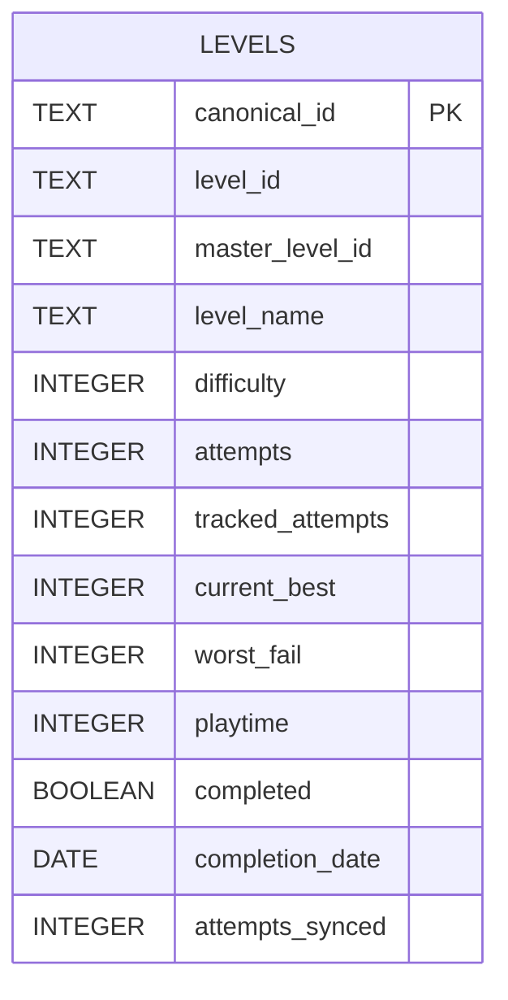

<h3>Database</h3>

The SQLite database stores the current state of every tracked Geometry Dash level variant. Data collected from Death Tracker and Playtime Tracker is transformed into a unified schema before being stored, allowing the pipeline to work with a single and consistent representation of each level. Google Sheets is synchronized from the SQLite database after linked-level aggregation, making SQLite the central storage layer of the application.

## Database Model

```mermaid
erDiagram

LEVELS {

TEXT canonical_id PK

TEXT level_id

TEXT master_level_id

TEXT level_name

INTEGER difficulty

INTEGER attempts

INTEGER tracked_attempts

INTEGER current_best

INTEGER worst_fail

INTEGER playtime

BOOLEAN completed

DATE completion_date

INTEGER attempts_synced

}
```
### Tables

The `levels` table stores the latest known state of every tracked level and each row represents a single Geometry Dash level (or one of its variants).

| Column | Type | Description |
| --------------- | ------- | -----|
| canonical_id    | TEXT    | Primary key used internally by gd-Pipeline|
| level_id        | TEXT    | Original Geometry Dash level ID|
| master_level_id | TEXT    | Representative Geometry Dash level ID used for linked-level aggregation. NULL for standalone levels. |
| level_name      | TEXT    | Name of the level |
| difficulty      | INTEGER | Difficulty value provided by Death Tracker |
| attempts        | INTEGER | Official attempt count reported by Geometry Dash |
| tracked_attempts| INTEGER | Attempt count reported by Death Tracker |
| current_best    | INTEGER | Highest completion percentage |
| worst_fail      | INTEGER | Highest percentage reached before completing the level |
| playtime        | INTEGER | Total playtime in seconds |
| completed       | BOOLEAN | Indicates whether the level has been completed |
| completion_date | DATE    | Date the level was completed  |
| attempts_synced | INTEGER | State flag for attempt, synchronization (NULL = in progress, 0 = pending sync, 1 = frozen) |

### Constraints

- `canonical_id` must be unique.
- `playtime` cannot be negative.
- `attempts` cannot be negative.
- `tracked_attempts` cannot be negative.
- `current_best` must be between 0 and 100.
- `worst_fail` must be between 0 and 99.
- `completion_date` may be NULL.
- `completed` defaults to FALSE.
- `master_level_id` may be NULL.
- `attempts_synced` must be NULL, 0, or 1.

## Indexes

| Name | Columns |
|------|---------|
| PRIMARY KEY | canonical_id |
| idx_master_level_id | master_level_id |

## Progress Statistics

Not every recorded run represents valid progression.

Only runs beginning at 0% contribute to:

- current_best
- worst_fail
- completed
- completion_date

Runs beginning from Start Positions still contribute to:

- attempts
- tracked_attempts
- playtime

## Design Decisions

### One Row per Level

Each level is represented by a single row in the database, then the pipeline continuously updates the record while the level is in progress. Once the level is completed, its gameplay performance data becomes immutable. The repository will only update the master_level_id if the level's linked group is modified by the player and attempts (just once) after the death tracker update the amount of attempts. Linked levels remain stored as independent rows, so their statistics are aggregated later using master_level_id.
This approach keeps the database synchronized with the player's current progress while avoiding unnecessary historical records.

### Canonical Identifier

The database uses `canonical_id` as its primary key instead of the original Geometry Dash level ID.
This allows the pipeline to distinguish between different variants of the same level, such as the Original level, Daily, Weekly, Event and Gauntlet levels, preventing key collisions while preserving the original `level_id`.

### Flexible Level IDs

Geometry Dash does not use a single identifier format for every level type.

Examples include:

- `144807542` (online level)
- `13-editor` (editor level)
- `5-local` (local level)

For this reason, both `canonical_id` and `level_id` are stored as `TEXT` instead of `INTEGER`. This allows the database schema to support every identifier format without introducing special cases.

### Playtime Storage

Playtime is stored as the total number of seconds spent on a level instead of a formatted duration.

Although Geometry Dash players commonly express playtime in hours, storing the raw value preserves full precision and avoids rounding errors.

### Linked Progression

SQLite stores each linked level as an independent record. During synchronization, gd-Pipeline aggregates every record sharing the same `master_level_id`.

The aggregated record is computed using the following rules:

| Field | Aggregation |
|--------|-------------|
| Level Types | Extract from canonical-ids |
| attempts | Sum |
| tracked_attempts | Sum |
| playtime | Maximum or Sum |
| current_best | Maximum |
| worst_fail | Maximum |
| completed | Any completed level |
| completion_date | Earliest completion date |

#### Notes
Playtime aggregation is especial, please check **docs/data_dictionary** and playtime field.
